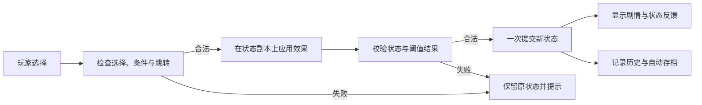

# 《无归之城》完整开发计划与实施方案

- 编写日期：2026-10-04
- 仓库：ForceMind/No-Way-Out
- 审查基线：`5367e64a02b644573396cb6e78a8a366ae2db8fe`
- 文档性质：后续开发的建议方案。本次交付为计划文档，功能实现按下面的里程碑推进。

## 1. 项目目标与范围

把现有的多身份文字冒险，发展成剧情连贯、选择有后果、存档可靠、适合电脑和手机游玩的完整浏览器游戏，同时让作者能够安全地维护剧情。

保留现有的 1937 年南京背景、沉重的叙事基调、身份视角和分支结构。第一轮工作的顺序为：修复会影响游玩和创作的问题，建立数据与存档约束，完善阅读体验，再用一条完整章节验证新的生存玩法。

建议首个完整版本的范围：

- 现有 12 个身份均可开始游戏，并有至少一条经实际验证的完整结局路线。
- 发布内容不存在缺失跳转、无说明的死路或因编辑器保存而丢失的条件。
- 现有生命、理智、物品系统保持兼容，增加有明确规则的条件与事件标记。
- 完成可靠的自动存档、手动存档、旧存档迁移和错误恢复。
- 完成手机阅读布局、文字显示速度、立即显示全文、键盘操作和剧情回顾。
- 完成剧情编辑器的安全编辑、校验、草稿恢复、导入及按身份导出。
- 用“市民三日生存章节”验证时间、食物、饮水、饥饿和疲劳，再决定扩展到哪些身份。
- 提供可重复执行的剧情校验、核心规则测试和浏览器回归检查。

后续扩展候选包括更多章节、身份之间的事件呼应、结局收藏、可视化剧情图，以及离线安装体验。这些内容不计入第一轮必需交付。

## 2. 当前基线与已发现的问题

### 2.1 已有功能与技术条件

| 方面 | 当前状态 | 开发影响 |
| --- | --- | --- |
| 技术结构 | 原生 HTML、CSS、JavaScript ES Modules | 继续使用现有结构，逐步拆分模块 |
| 游戏入口 | `index.html`、`js/game.js` | 已有身份选择、剧情显示、选项与结局 |
| 状态 | 生命、理智、字符串物品列表、当前身份与节点 | 缺少独立的规则层和状态校验 |
| 存档 | `localStorage` 中的 `nw_save` | 单个手动存档，无版本与结构校验 |
| 设置 | 音乐与音效音量 | 已支持持久化，缺少读取异常处理 |
| 叙事 | 12 个身份，按身份拆分的剧情文件 | 内容量已足够，需要先处理可达性与一致性 |
| 编辑器 | 节点与选项编辑、完整 JSON 导出 | 当前修改仅存在内存中，需手动拆分导出文件 |
| 音画 | BGM、合成点击/打字音效、粒子动画 | 浏览器验证已确认代表流程可用 |
| 开发环境 | Python 3.12、Node.js 24、Chromium、Python Playwright | 当前开发及测试无需新增运行依赖 |
| 仓库测试 | 无现有测试目录或 CI 流程 | 需要把有意义的检查纳入仓库 |

开发时继续用 Python 静态服务器运行。没有必须引入的后端、数据库或前端框架。当前保存的外网配置为禁用；Google 字体加载失败时，系统字体回退可用。

环境准备期间，已验证 20 个本地资源、12 份身份剧情模块，以及代表性的市民路线、存档读取、音量设置、物品条件和编辑器导出。该结果不等于全部身份、全部分支已经通关。

### 2.2 剧情数据统计

以下统计来自本次对实际导出对象的读取，而非源文件行数估算。

| 身份 | 节点数 | 选项数 | 无选项节点 | 从 start 结构上不可达的节点 |
| --- | ---: | ---: | ---: | ---: |
| 普通市民 | 165 | 251 | 19 | 3 |
| 难民 | 68 | 102 | 14 | 5 |
| 学生 | 57 | 84 | 6 | 0 |
| 教师 | 48 | 73 | 6 | 0 |
| 医生 | 46 | 65 | 6 | 0 |
| 商人 | 48 | 64 | 10 | 0 |
| 农夫 | 41 | 52 | 9 | 14 |
| 地下党员 | 53 | 69 | 10 | 3 |
| 孤儿 | 22 | 27 | 5 | 0 |
| 修女 | 21 | 24 | 5 | 0 |
| 流浪汉 | 20 | 21 | 6 | 0 |
| 车夫 | 27 | 28 | 9 | 0 |
| 合计 | 616 | 860 | 105 | 25 |

“无选项节点”是当前引擎当作结束节点的对象数量，不是去重后的结局数量。“结构可达”忽略物品条件，属于较宽松的检查；实际可玩的路线可能更少。不可达节点需要逐项判断是遗漏连接、废弃内容还是有意保留，不能直接全部删除。

### 2.3 问题清单与优先级

P0 表示会阻断游玩或导致创作数据丢失；P1 表示下一轮应完成的可靠性与体验工作；P2 表示可独立安排的扩展。

| 编号 | 优先级 | 代码或数据证据 | 用户影响 | 处理方案 |
| --- | --- | --- | --- | --- |
| B01 | P0 | 农夫 `start` 指向不存在的 `farmer_food`、`farmer_family` | 开局两个选择无法继续，停留在原节点并记录错误 | 补齐合理的开局分支或接入已存在的适当节点，并添加断链校验 |
| B02 | P0 | `removeChoice()` 重新选择节点，未执行删除 | 删除已有选项不起作用，还会重置未保存输入 | 操作编辑草稿中的选项对象，删除后保留其他输入 |
| B03 | P0 | 编辑器保存时只重建 `text/next/effect` 和 `text/choices` | 选项条件及未来扩展字段丢失 | 保存时保留原对象中未编辑的字段，增加完整往返测试 |
| B04 | P0 | 无效 effect JSON 被忽略后写成空对象 | 作者收到保存成功提示，但原效果被清空 | 校验失败时阻止整个保存，定位到具体选项，原草稿与数据不变 |
| B05 | P1 | `nw_save`、`nw_volume` 直接 JSON.parse，存档状态直接赋值 | 损坏记录或旧数据可能使界面报错或停在无法继续的状态 | 解析、结构校验、版本迁移、恢复提示及存储异常处理 |
| B06 | P1 | 12 处物品条件在所属身份的剧情中没有 addItem 来源 | 部分选项永远不出现 | 核对物品名称与来源，补充同身份获取路径或明确身份初始物品 |
| B07 | P1 | `history` 只有初始化与清空，没有写入 | 无法回顾已作出的选择 | 记录成功提交的节点与选择，提供回顾界面 |
| B08 | P1 | 生命和理智只限制到 0–100，未定义归零流程 | 数值与剧情后果脱节 | 在新玩法中定义阈值后果，迁移旧剧情时逐条评估 |
| B09 | P1 | 编辑器把选项文本插入 HTML 属性字符串 | 引号等内容会破坏表单，也可能被当成 HTML | 用 DOM API 设置 value/textContent 和事件监听 |
| B10 | P1 | 编辑器切换身份不清空 currentNodeKey，删除节点不检查引用 | 可能保留无效选中状态或制造新的断链 | 清空选择状态；删除前显示入边并阻止未解决的引用 |
| B11 | P2 | Google 字体不可用；编辑器没有图标声明 | 字体回退，编辑器可能请求缺失 favicon.ico | 保留字体回退，复用现有 icon.png，后续按资源需求优化 |

这些问题由源码和静态数据审查定位。除前面注明的环境功能验证外，本轮没有执行全分支浏览器复现；实施修复时应先为对应问题建立可失败的复现检查。

## 3. 玩家体验与内容设计

### 3.1 核心游玩循环

玩家选择身份，了解处境，阅读当前事件，根据资源与已知线索作出选择，看到状态和人物关系变化，再进入新的事件，最后得到具有因果解释的结局。

每个重要选择应至少改变路线、物品、资源、事件标记或结局条件中的一项。用于翻页的“继续”按钮不计入有效决策数量。已经说明的代价应当被实际执行，获得的关键物品应当有对应的用途。

失败前给出可理解的线索，避免大量没有提示的突然终结。隐藏情报可以产生意外，但结局回顾应解释关键选择的影响。保留沉重基调，同时让救助、守护、传递信息和保全亲友具有清晰的叙事价值。

### 3.2 身份差异

先深化现有身份，不增加新的身份数量。建议将差异放在可获得的资源、事件目标和选择方式上。

| 身份组 | 重点体验 | 先行样板 |
| --- | --- | --- |
| 普通市民、难民、农夫 | 寻找庇护、物资分配、家庭与求生选择 | 市民的三日章节 |
| 医生、教师、修女 | 照护、救助顺序、组织庇护与责任 | 医生的药品与救治路线 |
| 学生、地下党员 | 信息、协作、行动风险与保护他人 | 先修通地下党员的物品条件 |
| 商人、车夫 | 交换、运输、路线选择与资源代价 | 核对交易物品名与消耗 |
| 孤儿、流浪汉 | 弱势视角、信任、寻找帮助和临时生存 | 增加可追踪的人物帮助事件 |

跨身份事件先通过共享的地点、人物和背景事件形成呼应。当前存档按单个身份运行，不默认从另一条身份路线继承物品；需要的物品应在当前路线中有真实来源。

### 3.3 内容整理标准

- 每条发布路线有明确的开始、有效选择、后果反馈和结束。
- 所有跳转都有目标；循环必须有明确意义，避免无成本重复获得物品或生命。
- 物品名称、获得、消耗和条件保持一致；叙述“交出物资”时效果应真正扣除。
- 所有有意保留的不可达节点记录用途；发布的正式路线不能依赖它们。
- 结局补充稳定 ID、标题与结局类型，避免仅靠文案中的数字识别。
- 核对人物身份、地点、日期与背景事件；区分可核实的历史背景和虚构角色经历。
- 不以增加节点数作为内容质量目标；优先补齐有意义的决策和人物后续。

## 4. 技术架构与数据约定

### 4.1 渐进式模块拆分

保留原生 ES Modules，先在现有入口下建立小模块。每次拆分只改变职责划分，并用现有路线验证行为一致。

建议目录如下；这是目标结构，目前尚未创建这些模块。

```text
js/
  game.js                    # 页面启动与各模块协调
  data.js                    # 身份、剧情与内容版本的入口
  effects.js                 # 保留已有音频与粒子效果，逐步整理
  core/
    engine.js                # 选择、状态转移、结束与事件
    state.js                 # 默认状态与状态校验
    conditions.js            # 条件判断及不可选原因
    choice-effects.js        # 效果应用和数值边界
    story-validator.js       # 游戏与编辑器共用的数据校验
    save-store.js            # 版本化存档与恢复
  ui/
    game-view.js             # 剧情、选项、状态、回顾的渲染
    settings-view.js         # 设置界面与文字速度
  editor/
    editor.js                # 编辑器入口
    draft-store.js           # 草稿状态、撤销和恢复
    io.js                    # JSON 导入、分身份导出
  stories/                   # 保留各身份剧情模块
scripts/
  validate-stories.mjs        # 命令行剧情校验
tests/
  unit/                      # 不依赖浏览器的规则与存档测试
  e2e/                       # 浏览器功能与编辑器往返测试
```

规则模块接收状态和剧情数据，返回下一状态与事件；DOM、音频、存储和计时器由外层管理。时间和随机来源作为明确输入，便于重放和测试。

### 4.2 选择必须一次完整提交

当前代码先改变生命和物品，再尝试跳转。后续流程改为先检查选择属于当前节点、条件满足且目标存在，在状态副本上应用效果，全部成功后才提交。



打字期间、选择提交期间和切换画面时统一管理输入。重复点击不能重复获得物品、扣除资源或推进时间。读档只恢复并显示已有状态，不重新执行上一次选项效果。

### 4.3 剧情格式与兼容策略

第一阶段保持 `js/stories/*.js` 的命名导出和 `text/choices/next/condition/effect` 格式，不同时改写 616 个节点。内容版本和规则配置放在独立的 manifest 中，避免被误认为剧情节点。

建议的新字段包括选项稳定 ID、节点章节与地点、事件标记和结构化结局信息。旧节点可通过适配器读取；新字段由版本和校验规则约束。

条件优先支持已有 `hasItem`，随后增加最低生命、最低理智、事件标记和数值资源条件。效果继续支持增减生命与理智、增减物品，随后增加资源消耗、事件标记和明确的时间推进。

保留对旧 `changeHealth` 字段的读取，在迁移时统一到 `health`；同时出现两个生命修改字段时报告冲突，避免隐式重复扣除。未知规则字段必须给出明确校验结果，不能当作没有条件直接放行。

物品第一轮保持字符串列表，以免无必要地改变旧存档。建立统一物品目录后，将旧名称映射到稳定 ID。金条、金银等词是否代表同一物品要由剧情意图决定，不能只通过模糊名称自动合并。

### 4.4 剧情校验分层

1. 格式检查：每个身份有 start，节点文本和选项字段类型正确，效果数值有限且合法。
2. 引用检查：next 存在；删除或重命名节点前检查入边；结局与普通节点声明一致。
3. 图检查：统计结构不可达节点与不能到达任何结局的区域；循环允许存在，但需要内容判断。
4. 条件检查：寻找没有初始物品或获取来源的条件，核对资源代价和事件标记来源。
5. 状态路径检查：对代表路线进行实际状态推进，验证“先获得物品，后出现选项”等因果关系。

断链、格式错误及无效规则属于阻断错误。未发布草稿的不可达性可先作为警告。发布章节中无法满足的条件必须解决或有明确的内容说明。

图搜索忽略条件时只能证明结构性质。有限状态搜索还需限定物品、标记、循环和数值范围；无法穷尽的部分由固定路径测试与人工通关补充，不宣称数学上覆盖了全部玩法。

## 5. 存档、历史与设置方案

建议存档使用包含存档格式版本、内容版本、保存时间和状态的对象：

```json
{
  "saveVersion": 2,
  "contentVersion": "planned-content-version",
  "savedAt": 0,
  "state": {
    "currentIdentity": "citizen",
    "currentNode": "start",
    "inventory": [],
    "health": 100,
    "sanity": 100,
    "history": []
  }
}
```

示例仅说明拟定格式。新玩法的资源、时间和标记按规则配置补入，旧记录迁移时使用明确默认值。

- 提供一个自动档和三个手动档，显示身份、章节、最后保存时间和当前节点摘要。
- 自动档在成功完成状态转移后保存，不在每次打字或读档时重复保存。
- 读取旧 `nw_save`，验证身份、节点、物品与数值后迁移；迁移失败时保留原记录，并提供恢复或重新开始的入口。
- 内容更新导致节点更名时提供显式映射；不能把未知节点静默改为 start。
- 存储不可用或空间不足时提示玩家，本次游戏可继续运行；不得显示保存成功。
- 存档历史记录成功选择的 ID、起点和终点。回顾界面展示文本快照，避免剧情修改后旧记录完全失去上下文。
- `nw_volume` 采用同样的异常保护，并扩展文字速度、立即显示模式、动效开关和字体大小。
- 结局收藏与当前游戏状态分开保存，新增游戏不会覆盖已获得的结局记录。

## 6. 交互与视觉方案

延续深色、低饱和与暗红色强调的视觉方向，重点改善长时间阅读和手机操作。

| 页面 | 具体改进 | 验收方式 |
| --- | --- | --- |
| 标题页 | 新游戏、继续游戏、存档管理、设置；有档时显示继续入口 | 无档与有档两种状态均测试 |
| 身份页 | 身份说明、核心体验提示、清晰的确认与重选 | 12 个身份均可选；小屏可滚动 |
| 游戏页 | 稳定阅读区域、状态变化提示、可折叠物品栏、章节与地点 | 长文本和大量选项不遮挡操作 |
| 文字显示 | 多档速度、点击/空格显示全文，全文完成后再允许选项提交 | 不丢失文字，不重复完成回调 |
| 条件选项 | 可见但不可选的已知行动给出原因；涉及秘密的行动仍可隐藏 | 不提前泄露未获得的信息 |
| 剧情回顾 | 查看经过的节点与实际作出的选择 | 读档后历史一致 |
| 结局页 | 结局标题、关键经历、资源结果、返回菜单或重开 | 与正常节点显示清晰区分 |
| 设置页 | 文字速度、字体大小、音量、减少动效 | 关闭后生效，刷新后保留 |

手机优先检查 360、390、768 像素宽度，桌面检查 1366 像素宽度。操作目标建议至少 44×44 CSS 像素，正文可以滚动，主要按钮保持可触达，避免全局 overflow:hidden 把内容截断。

键盘可操作身份、选项和模态框；保留清晰的焦点样式。模态框打开时管理焦点，关闭后返回原触发按钮。减少动效设置及系统 prefers-reduced-motion 应影响粒子和打字动画。音频不被浏览器允许时，文字与选择流程仍然可继续。

资源优化单独安排：当前 BGM 约 4.1 MB，icon.png 约 1.6 MB。先通过请求记录和实际显示尺寸判断加载策略，再制作适当尺寸的图标与可选音频版本，保留原始素材。

## 7. 剧情编辑器方案

编辑器分两轮完成，先解决数据丢失，再提高创作效率。

### 7.1 第一轮：可靠编辑

- 为节点和选项建立编辑草稿模型，DOM 只显示模型；删除、新增、保存遵循同一套逻辑。
- 删除某个选项后保留其余选项、条件、效果和未保存文字。
- 保存仅覆盖实际编辑的字段，保留已有条件和未识别的扩展字段。
- 无效 JSON、空 ID、缺失目标等错误显示在对应字段旁；全部通过后才写入当前数据。
- 文本通过 DOM 属性赋值，包含单双引号、换行及特殊字符时显示和导出一致。
- 切换身份时清空节点选中状态；存在未保存修改时明确提示保存、放弃或取消切换。
- 删除 start 或被引用节点前显示影响范围，未解决引用时不执行删除。

### 7.2 第二轮：创作工具

- 条件与效果提供常用字段表单，保留 JSON 高级编辑入口。
- 支持按 ID 和文本搜索、入边/出边查看、从当前节点开始的游戏预览。
- 草稿自动恢复、有限步数的撤销/重做、手动 JSON 备份。
- 导入 JSON 时先做结构与引用检查，展示变更摘要，再合入草稿；不执行导入文件中的 JavaScript。
- 按身份导出可直接替换的 `.js` 模块，保留原有导出名，例如 citizenData；同时保留完整 JSON 备份。
- 文件生成使用 JSON 序列化包装，导出之后重新导入并比较，证明字段与字符没有丢失。
- 普通浏览器通过下载交付文件；作者将确认后的文件放回 `js/stories/`，不把“下载成功”描述成已经写入仓库。

节点图在文本搜索与引用列表已经稳定之后再考虑。首轮编辑器以桌面创作为主，平板可用；手机上的完整图形创作不作为首发条件。

## 8. 生存玩法的完整样板

### 8.1 样板范围

先制作独立的“市民三日生存章节”，覆盖安顿、寻找资源、帮助他人、休息和第三日的路线决策。每条主路线目标为 8–12 次有效选择，包含至少三个由行动和资源共同决定的结局；游玩时长在试玩后测量。

通过章节规则配置启用新系统，旧的 616 个节点不会自动按每次点击扣粮或推进时间。旧路线可继续运行，迁移新规则时逐章处理。

### 8.2 初始规则建议

下列数值用于第一轮样板试玩，属于待调优参数。

| 状态或资源 | 初始值 | 规则 |
| --- | ---: | --- |
| 生命 | 100 | 范围 0–100，归零进入明确的生命耗尽流程 |
| 理智 | 100 | 范围 0–100，低值改变叙述或行动，归零进入可解释的精神耗竭事件 |
| 食物 | 2 份 | 日结消耗 1 份；有库存时先消耗库存 |
| 饮水 | 2 份 | 日结消耗 1 份；缺水影响疲劳与生命 |
| 饥饿 | 0 | 范围 0–100；缺少当日食物时增加 20，日结时达到 40 则生命减少 10；正常进食的日结降低 10 |
| 疲劳 | 0 | 范围 0–100；搜寻等消耗行动约增加 10，休息约减少 25 |
| 时间 | 第一天清晨 | 每天清晨、午后、夜晚；有时间成本的行动明确推进一个时段 |

把缺粮、缺水、过度疲劳的结算集中到规则函数中。缺少当日饮水时生命减少 5、疲劳增加 15；疲劳达到 80 时，高消耗行动被限制并给出需要休息的原因。理智不高于 20 时进入低理智状态，归零触发一次精神耗竭事件，后续由章节提供可解释的选择。

日结按具体日期记录，重绘、刷新和读档不能重复扣除同一天的资源。休息消耗时间，避免无限休息恢复状态。上述阈值与初始资源需要通过三日样板验证；不直接改变旧剧情的归零行为。

事件标记记录是否帮助某人、获得某条情报、修补住所等；关键标记影响第三日的选项与结局。原有关键物品继续放入物品栏，食物和饮水使用有数量的资源字段。

第一轮采用确定性的事件与明确条件，便于平衡和复现。随机事件作为后续增强：确有需要时引入固定种子并写入存档，使读档不会反复刷新结果。

### 8.3 三日内容骨架

1. 第一天：选择临时住所；在获取食物、获取饮水、帮助邻人和休息之间取舍；用夜间事件解释时间与资源规则。
2. 第二天：之前帮助的人提供有限回报或信息；发生资源短缺和行动风险；选择保护现有资源、援助他人或探查离开路线。
3. 第三天：已有情报、物品、身体状况和人物关系共同决定可选路线；以生还、守护他人或失败等类型结束，回顾关键决策。

建议的三条结局路线如下；具体情节在编写章节时补齐。

| 结局路线 | 条件示例 | 叙事结果 |
| --- | --- | --- |
| 带亲友转移 | 已获得并核实转移线索、生命至少 30、疲劳低于 80、保留 1 份饮水 | 离开当前危险区域，说明哪些帮助与准备使转移成为可能 |
| 留守庇护 | 已修补住所、获得邻人协助、理智至少 20、保留 1 份食物 | 留在庇护点守护他人，以第三日结束后的处境作为阶段性结局 |
| 资源或行动失败 | 生命耗尽，或在已给出风险线索后选择无法承担的行动 | 根据实际原因结束，回顾资源短缺或行动决策，不统一套用同一句死亡文本 |

结局所需资源在最终选择时消耗，重复点击或读档不再次扣除。全部主路线必须能够通过正常选择进入，不能把初始资源不足的结局设计成无法满足的展示项。

样板验收：同一条选择序列得到一致状态；至少两条路线在第二天出现可感知的差异；没有必须靠反复读档刷新随机数才能通过的检查；完成正常资源、资源耗尽、生命耗尽和存档恢复四类通关验证。

## 9. 分阶段实施计划

以下为单人专注开发的初步工程工作量估算，用于安排顺序，不是固定交付日期。大篇幅剧情重写、素材制作和人工历史资料核对需要另计。已完成的环境准备不计入这些估算。

| 里程碑 | 前置条件 | 工作内容 | 预计工程工作量 | 交付与退出条件 |
| --- | --- | --- | --- | --- |
| M1：可稳定游玩与编辑 | 本计划 | 修复 B01–B04；补齐输入和存储异常保护；建立断链检查与回归基线 | 2–3 工作日 | 农夫开局三个选项可继续；编辑器删除与保存不丢数据；非法输入不产生半次保存；无缺失跳转 |
| M2：核心规则与存档约定 | M1 | 模块拆分、原子状态提交、版本化数据与存档、条件/效果规范、历史记录；逐项处理缺失物品来源 | 3–4 工作日 | 旧存档可迁移；读档不重复执行效果；代表路线与拆分前一致；规则错误被校验捕获 |
| M3：阅读与手机体验 | M2 | 文字速度和跳过、回顾、存档槽、设置、移动布局、键盘及动效选项 | 2–3 工作日 | 四个目标屏宽核心流程可用；长文本与选项不遮挡；设置与各存档独立持久化 |
| M4：编辑器创作流程 | M2，复用 M3 的界面规范 | 条件表单、草稿恢复、引用检查、搜索、预览、JSON 导入与分身份导出 | 3–4 工作日 | 编辑—保存—导出—导入完整往返无丢字段；引用错误阻止破坏性操作 |
| M5：三日生存样板 | M2、M3、M4 | 新章节、时间与资源规则、事件标记、三类结局与调优 | 3–5 工作日，另计剧情创作 | 完成样板验收；旧路线兼容；所有新增规则有确定性检查 |
| M6：内容整理与完整版本 | M1–M5 | 审核全部身份、处理遗留图问题、结局目录、文档与资源整理、静态发布包验证 | 2–4 工作日，另计大规模内容改写 | 满足第 11 节完整版本标准，形成可发布静态版本 |

工程部分合计约 15–23 个工作日。先交付 M1 再评估后续估算；发现新的基础问题时更新剩余范围。M3 与 M4 在职责明确后可交错实施，M5 依赖稳定的规则和创作流程。

### 9.1 建议的首批编码任务

| 顺序 | 任务 | 具体文件或产物 | 必须通过的检查 |
| --- | --- | --- | --- |
| 1 | 把剧情断链检查纳入仓库 | `scripts/validate-stories.mjs` | 能准确报告当前两处缺失目标，带身份与节点信息，失败时退出非零 |
| 2 | 修通农夫开局 | `js/stories/farmer.js` | 三个开局选项分别进入有效节点；效果只应用一次 |
| 3 | 修复选项删除和草稿保留 | `editor.html`，按需要提取小模块 | 连续删除、新增、再保存后内容与界面一致 |
| 4 | 修复字段丢失与 JSON 错误处理 | 编辑器保存逻辑 | 含 condition 的节点往返不变；无效 JSON 阻止保存并保留原值 |
| 5 | 保护文本输入与存储读取 | 编辑器 DOM、游戏存储逻辑 | 引号与换行可编辑；损坏存档、损坏音量记录不使游戏崩溃 |
| 6 | 补充回归说明与启动文档 | `tests/`、`README.md` | 实际命令与文档一致；原有浏览器烟雾验证通过 |

首批任务可以拆成“剧情数据修复”和“编辑器可靠性修复”两个小改动，便于分别检查和回退。功能重构安排在已有回归检查之后。

## 10. 测试与验证方案

### 10.1 不依赖外部服务的检查

使用 Node.js 原生测试能力和 ES Modules，优先保持零新增运行依赖。建议命令：

```bash
node scripts/validate-stories.mjs
node --test --test-isolation=none tests/unit/*.test.mjs
```

剧情校验与首批单元测试已在 M1-1 创建。使用 --test-isolation=none 确保当前云机器实际执行具名用例；默认的进程隔离运行在本环境中仅返回文件级结果。后续单元检查重点为：条件满足与不满足、效果增减和边界、无效跳转无状态变化、时间结算幂等、存档迁移与损坏恢复。

### 10.2 浏览器回归矩阵

| 场景 | 关键断言 |
| --- | --- |
| 12 个身份开局 | 身份选择、确认、start 文本及有效选项均可用 |
| 农夫开局分支 | 三个选项实际推进，不出现缺失节点错误 |
| 代表性条件路径 | 获得物品前后选项状态变化正确，消耗后状态再次变化 |
| 游戏状态与读档 | 生命、理智、物品、节点、历史和资源恢复一致 |
| 重复输入 | 连点和打字时跳过不会重复应用效果或时间成本 |
| 编辑器往返 | 删除与新增有效，未知字段和条件保留，导出重新导入一致 |
| 编辑器异常 | 无效 JSON、重复 ID、断链、取消切换均不损坏草稿 |
| 存档异常 | 无档、损坏记录、旧版本、未知内容版本、存储不可用都有可恢复反馈 |
| 手机与键盘 | 目标屏宽下主要控件可见可操作，模态框焦点与键盘选择可用 |
| 字体或音频失败 | 核心文字与选择流程可继续，可选资源问题被单独记录 |

环境中现有的验证脚本位于仓库之外：`/workspace/library-files/no-way-out-smoke.py`。本地复测可以继续使用它：

```bash
python3 -m http.server 8000 --bind 127.0.0.1 --directory /workspace/No-Way-Out
```

在另一执行会话中运行：

```bash
python3 /workspace/library-files/no-way-out-smoke.py
```

M1-1 已将基线检查纳入 tests/e2e/smoke.py，运行 python3 tests/e2e/smoke.py 即可；脚本自动启动并关闭自己的随机端口静态服务器，不依赖环境外路径。环境外脚本继续作为原始基线。核心逻辑与数据变化时，应同步更新测试所依据的正式行为。

当前仅 Chromium 的代表性流程已经验证。Firefox、WebKit 和真实手机的兼容检查属于后续发布工作，执行后才记录结果。截图只能辅助判断布局，不能替代真实点击、状态和导出检查。

### 10.3 持续集成

M1 先提供本地可执行检查，M2 接入剧情与规则检查，M4 补齐编辑器浏览器检查，M6 固化完整发布检查。建议在 push 和 pull_request 时按以下顺序执行：

1. 检出当前提交，启用 Node.js 24，运行剧情校验及原生单元测试。
2. 在独立测试依赖声明中固定 Python Playwright 版本，准备对应浏览器；云环境已有工具不代表 CI 机器也预装了它们。
3. 启动本次 CI 的静态服务器，运行浏览器回归；完成后仅停止该次创建的进程。
4. 失败时保存服务器日志、浏览器追踪和相关截图；保留原命令退出码，不以日志过滤后的结果决定成功。
5. 区分通过、失败、跳过及未运行的检查；零用例不能视为覆盖完成。

CI 需要下载的测试工具只属于开发依赖。当前云机器可继续使用预装工具；新增安装步骤及需要的网络目的地应在实际引入依赖时记录。

## 11. 完整版本验收与交付

完整版本至少满足以下条件：

1. 所有发布剧情通过格式、引用和规则检查，缺失跳转为零。
2. 25 个既有结构不可达节点与 12 处缺少物品来源的条件均有处理记录；正式路线中的问题已修通，有意留存内容明确标识。
3. 12 个身份各有一条完整路线完成浏览器通关，新增样板的主要结局全部经过实际验证。
4. 编辑器保存和导出无丢字段问题；无效输入不会覆盖正常内容；刷新可恢复草稿。
5. 新档、旧档迁移、自动档、手动档和损坏记录的处理经过验证。
6. 360、390、768、1366 像素布局与键盘核心操作通过，阅读与按钮不被遮挡。
7. 原有功能、原生静态运行方式和历史剧情读取保持可用。
8. 首次启动、一次完整状态转移、读档和编辑器往返均没有未解释的应用异常；可选资源问题单独列明。
9. README、测试说明、内容版本说明和变更记录与实际代码一致。

交付产物包括游戏源文件、作者编辑器、剧情数据、测试与校验命令、版本迁移说明，以及可放到静态托管服务的发布目录。发布前验证站点根路径和项目子路径下的模块、音频、样式与图标加载，避免本地运行正常而静态站点路径出错。游戏静态托管发布与 Codex 云环境发布属于两个不同交付动作，分别记录验证结果。

性能验收先建立当前版本的测量基线，再设定目标。关注本地首屏请求、长文本下的操作响应、粒子与音频开销，以及资源总体积。优化必须保留音频和图标原始素材，压缩结果以实际加载和可读性验证。

## 12. 主要依赖、风险与取舍

| 项目 | 对计划的影响 | 具体应对 |
| --- | --- | --- |
| 现有剧情数据量较大 | 一次迁移容易误改路线 | 先建立校验，再按身份或章节迁移，保留原有 ID 与适配层 |
| 数值系统改变旧剧情 | 可能让原有路线无法完成 | 新生存规则先按章节启用，旧路线行为由回归检查保护 |
| 存档与内容一起升级 | 节点变化影响旧记录 | 分开记录存档版本和内容版本，维护必要的节点映射 |
| 编辑器保存覆盖信息 | 扩展玩法越多，丢字段影响越大 | 先修完整往返，再引入新字段与创作工具 |
| 内容来源与因果不完整 | 结构可达仍不代表实际可玩 | 补物品来源、消费效果与事件条件，配合实际路径测试 |
| 仅本机自动化验证 | 不能代表所有设备兼容 | 完整版本阶段补充其他浏览器与真实手机验证 |
| 当前网络配置受限 | 下载新依赖可能受阻 | 沿用已有工具与本地资源；新增外部资源时单独记录必要域名及安装步骤 |
| 工程估算不包含大量创作 | 新内容规模直接影响周期 | 样板先固定章节规模，测量创作和测试成本后再扩大 |

本方案的默认决策是维持静态架构、原生模块、现有 12 个身份和兼容旧剧情；先完成 M1，再通过一条完整样板决定新增玩法的规模。每个里程碑交付可运行版本、相关验证结果与剩余问题记录。

## 13. 实施进度

开发分支：`codex/no-way-out-development`。每一步完成后更新本节与 `DEVELOPMENT_LOG.md`，运行相关检查并创建独立 Git 提交，随后同步远端。

| 里程碑 | 当前状态 | 记录 |
| --- | --- | --- |
| M0：计划与开发流程 | 已完成本地记录 | 完整方案纳入版本控制，建立逐步提交与验证记录 |
| M1：稳定性 | 已完成 | M1-1–M1-5 已提交本地；19 项单元测试和浏览器回归通过 |
| M2：核心规则与存档 | 已完成 | M2-1–M2-3 已提交；48 项单元测试及浏览器回归通过，物品来源问题清零 |
| M3：阅读与手机体验 | 已完成 | 四种屏宽浏览器回归通过；阅读、历史、存档与结局收藏已提交 |
| M4：编辑器创作流程 | 已完成 | 55 项单元测试及完整创作往返浏览器检查通过 |
| M5：三日生存样板 | 已完成 | 65 项单元测试，三种结局及结算恢复浏览器验收通过 |
| M6：完整版本 | 本地工程验收完成 | 82 项单元测试、十二身份通关、三类新结局与根/子路径发布验证通过；CI 配置完成，远端执行待同步 |

远端同步当前受网络策略阻断：GitHub HTTPS 请求返回 CONNECT 403。已保存仅增加 github.com 的网络配置草稿；配置生效后重试同步，不将本地提交描述为已经推送。

本地交付为内容 0.3.0：dist/no-way-out 与 ZIP。未执行的远端 CI、上线部署、其他浏览器/真实手机、玩家与史实审校仍按开发记录列为后续工作。原计划估算用于安排工程和内容投入，不作为这些尚未执行事项的完成声明。
